# 学相伴Go语言全栈课程

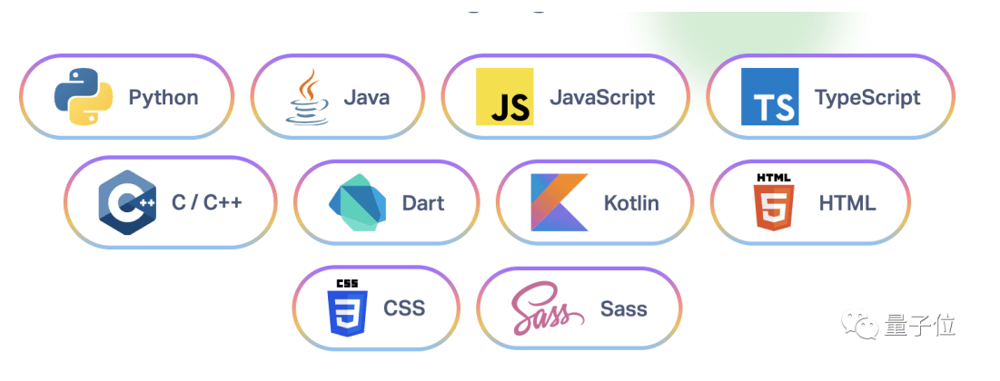

## Go语言的Logo

作为程序员，我们每天会用到大量的编程语言，打开界面会碰到很多logo

在正式学习Go语言之前，我们先来了解一下Go语言的Logo。

也就是它,下面这个动物，gopher [ˈɡoʊfər] ，囊地鼠，是北美的一种地鼠。也有人说这是土拨鼠，大家自行理解吧。

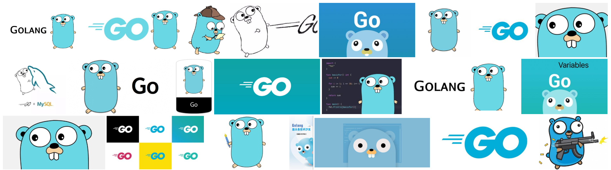

> 故事

Rob Pike是Go的发明者之一，贝尔实验室UNIX小组成员之一，UTF-8的设计人。他最喜欢做似乎就是

 - 发明操作系统
 - 发明编辑器
 - 发明语言

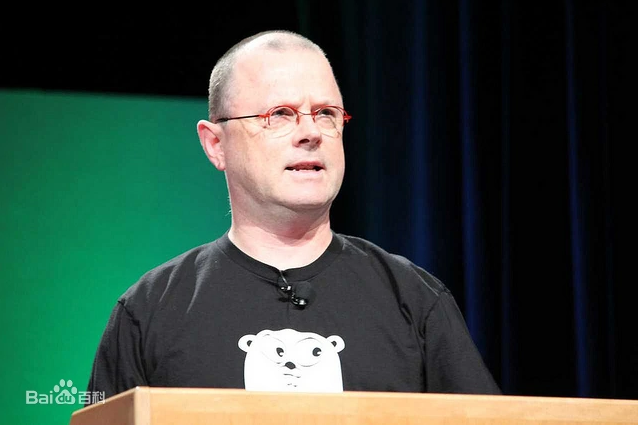

Go语言这萌萌的吉祥物是由Rob Pike的妻子 Renee French绘制的。

就是她设计出了Golang吉祥物，可爱的 Gordon [ˈgɔrdən]，比心心！

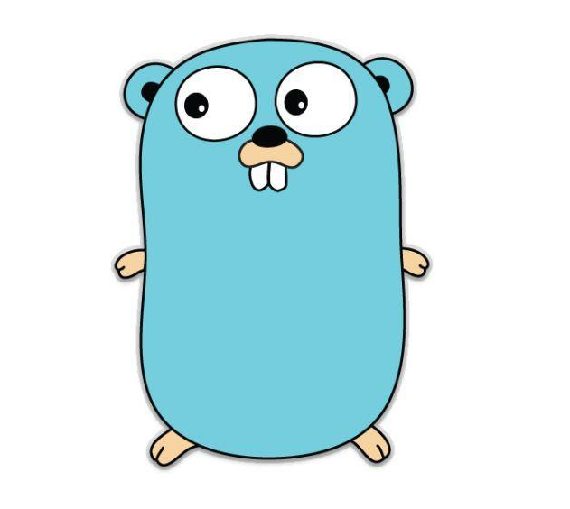

## 谷歌工程师的20%时间

谷歌的“20%时间”工作方式，**允许工程师拿出20%的时间来研究自己喜欢的项目**。语音服务Google Now、谷歌新闻Google News、谷歌地图Google Map上的交通信息等，全都是20%时间的产物。

**Go语言最开始也是20%时间的产物。**


## Go语言的创始人

> 为什么需要一个新的语言

C 系统效率  开发起来比较复杂 

Java 开发相对来说简单了 （面向对象---）更符合人的思维  很多大型企业在用  培训机构  ssm ssh  springboot   java 人才多  单价低


效率要高 + 开发简单 =  兼顾  （创造一种新语言  Go）   12 年  移动端 智能手机   85   95   时代进步了，我们需要一些更高效的东西，而不是一些历史的东西


最近十年来，C/C++在计算领域没有很好得到发展，并没有新的系统编程语言出现。对开发程度和系统效率在很多情况下不能兼得。要么执行效率高，但低效的开发和编译，如C++；要么执行低效，但拥有有效的编译，如.NET、Java；所以需要一种拥有较高效的执行速度、编译速度和开发速度的编程语言，Go就横空出世了。


15年  脚本 （游戏辅助）

师傅 （逆向的 ， C 、C ++ 底层编译）  8:30 - 40分钟 （改了部分代码 ---）  40分钟  

崩溃了 Bug  强类型 （代码要严格按照要求，出错了，在开发的时候就会报错！）

随便的语言 （代码---- 编译器（优化）  --- 程序）  JS  凌乱 （） 跑起来后才能发现   js  （弱类型的语言，约束比较小，开发轻松，低级错误）

传统的语言比如c++，大家花费太多时间来学习如何使用这门语言，而不是如何更好的表达写作者的思想，同时编译花费的时间实在太长，对于编写-编译-运行这个链条来说周期太长。动态语言如Python，由于没有强类型的约束，很多问题需要在运行时发现，这种低级错误更应该交给编译器来发现。 Python  Java


每个语言都有自己的优点 = 整合 12年 Go


人力成本越来越高 （少做点事，提高效率）

机器越来越便宜   （机器发挥性能）

机器的性能越来越厉害

在开发效率和运行速度上达到平衡

**go出现之前，无论汇编语言、还是动态脚本语言，在执行效率和开发效率上都不能兼备。**

这个世界上总有一帮人在想着做这种事情，别人的用的不舒服，就自己开发了一个！

Go的三个作者分别是： Rob Pike（罗伯.派克），Ken Thompson（肯.汤普森）和Robert Griesemer（罗伯特.格利茨默） 。

Rob Pike：曾是**贝尔实验室**（Bell Labs）的Unix团队，和Plan 9操作系统计划的成员。他与Thompson共事多年，并共创出广泛使用的**UTF-8 字元编码。**

Ken Thompson：**主要是B语言、C语言的作者、Unix之父。1983年图灵奖（Turing Award）和1998年美国国家技术奖（National Medal of Technology）得主。他与Dennis Ritchie是Unix的原创者。**Thompson也发明了后来衍生出C语言的B程序语言。

Robert Griesemer：在开发Go之前是**Google V8 谷歌浏览器底层核心之一**、Chubby和**Java虚拟机 HotSpot JVM**的主要贡献者。

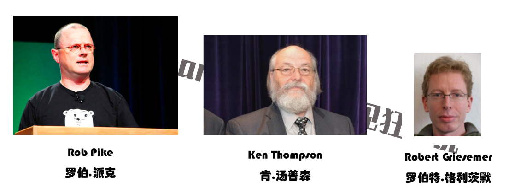

此外还有Plan 9开发者Russ Cox、和曾改善目前广泛使用之开原码编译器GCC的Ian Taylor。

## Go语言的发展

> 故事一：名字的来源

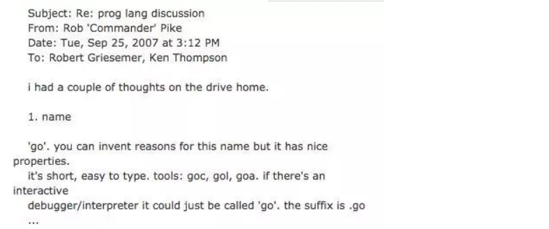
这是一封由 Rob Pike 在 2007 年 9 月 25 号，星期二，下午 3：12 回复给 Robert Griesemer、Ken Thompson 的有关编程语言讨论主题的邮件。

邮件正文大意为：

斗罗大陆.txt   文本类型

.java  文件后缀  Java代码文件

.mp4   文件类型

.jpg 

.c 

.py

**.go**  

在开车回家的路上我得到了些灵感，给这门编程语言取名为“go”，它很简短，易书写。工具类可以命名为：go c、 go l、go a。交互式的调试工具也可以直接命名为“go”。语言文件后缀名为 .go 等等,  

这就是 Go 语言名字的来源。

自此之后 Robert、Rob 和 Ken 三个人开始在 Google 内部进行了研发，**一直到了 2009 年，Go 正式开源了**。

Go 项目团队将 2009 年 11 月 10 日，即该语言正式对外开源的日字作为其官方生日。

源代码最初托管在 http://code.google.com 上，之后几年才逐步的迁移到 GitHub 上。 Go语言现在的地址 GitHub。


**任务一：注册github账号和gitee账号。用来存放我们未来写的代码或者下载一些开源项目使用   Go**

代码字符串.go ---   编译  --- 运行出结果

> 故事二：新伙伴的加入 

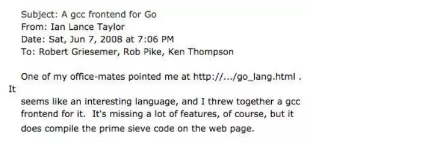

这是一封由 Ian Lance Taylor 在 2008 年 6月 7 日（星期六）的晚上 7：06 写给 Robert Griesemer、Rob Pike、 Ken Thompson 的关于 Go gcc 编译器前端的邮件。

邮件正文大意如下：

**我的同事向我推荐了这个网站 http://…/go_lang.html 。这似乎是一门很有趣的编程语言。我为它写了一个 gcc 编译器前端。**虽然这个工具仍缺少很多的功能，但它确实可以编译网站上展示的那个素数筛选程序了。

在这个编译器中去写代码了，并且可以实现运行。

Ian Lance Taylor 的加入以及第二个编译器 (gcc go) 的实现 在带来震惊的同时，也伴随着喜悦。

**这对 Go 项目来说不仅仅是鼓励，更是一种对可行性的证明。**语言的第二次实现对制定语言规范和确定标准库的过程至关重要，同时也有助于保证其高可移植性，这也是 Go 语言承诺的一部分。

自此之后 Ian Lance Taylor 成为了设计和实现 Go 语言及其工具的核心人物。3 + 1

> 故事三：http.HandlerFunc、I/O 库

Russ Cox 在2008年带着他的语言设计天赋和编程技巧加入了刚成立不久的 Go 团队。

Go的基础  （定义一些变量  、  判断循环 。解题，算术）

一段代码的集合  （1 + 1 = 2）

Go 它十分的灵活和 C、Java 有很大的区别

Russ 发现 Go 方法的通用性意味着函数也能拥有自己的方法，这直接促成了 http.HandlerFunc 的实现，让 Go 一下子变得无限可能的特性。

Russ 还提出了更多的泛化性的想法，比如 io.Reader 和 io.Writer 接口，奠定了所有 I/O 库的整体结构。

> 故事四：cryptographic 

安全专家 Adam Langley 帮助 Go 走向 Google 外面的世界。

Adam 为 Go 团队做了许多不为外人知晓的工作，包括创建最初的 http://golang.org 网站以及 build dashboard。

不过他最大的贡献当属创建了 cryptographic 库。

起先，在我们中的部分人看来，这个库无论在规模还是复杂度上都不成气候。但是就是这个库在后期成为了很多重要的网络和安全软件的基础，并且成为了 Go 语言开发历史的关键组成部分。

许多网络基础设施公司，比如 Cloudflare，均重度依赖 Adam 在 Go 项目上的工作，互联网也因它变得更好。我记得当初 beego 设计的时候，session 模块设计的时候也得到了 Adam 的很多建议，因此，就 Go 而言，我们由衷地感谢 Adam。

 越来越完善 

go的底层语言是什么？    C  

1.5 版本的时候    Go语言重写了Go语言 1.5 +  Go   汇编、计算机指令

第三方库，还依赖于C 。

开发Go、只要安装Go语言环境即可！


> 时间线小结

 - 2007年9月，Rob Pike在Google分布式编译平台上进行C++编译，在漫长的等待过程中，他和Robert Griesemer探讨了程序设计语言的一些关键性问题，他们认为，简化编程语言相比于在臃肿的语言上不断增加新特性，会是更大的进步。随后他们在编译结束之前说服了身边的Ken Thompson，觉得有必要为此做一些事情。几天后，他们发起了一个叫Golang的项目，将它作为自由时间的实验项目。

- 2008年5月 Google发现了GO语言的巨大潜力，得到了Google的全力支持，这些人开始全职投入GO语言的设计和开发。

- 2009年11月 GO语言第一个版本发布。**2012年3月 第一个正式版本Go1.0发布**。

- 2015年8月 go1.5发布，这个版本被认为是历史性的。完全移除C语言部分，使用GO编译GO，少量代码使用汇编实现。另外，他们请来了内存管理方面的权威专家Rick Hudson，对GC进行了重新设计，支持并发GC，解决了一直以来广为诟病的GC时延（STW）问题。并且在此后的版本中，又对GC做了更进一步的优化。到go1.8时，相同业务场景下的GC时延已经可以从go1.1的数秒，控制在1ms以内。GC问题的解决，可以说GO语言在服务端开发方面，几乎抹平了所有的弱点。

在GO语言的版本迭代过程中，语言特性基本上没有太大的变化，基本上维持在GO1.1的基准上，并且官方承诺，新版本对老版本下开发的代码完全兼容。事实上，GO开发团队在新增语言特性上显得非常谨慎，而在稳定性、编译速度、执行效率以及GC性能等方面进行了持续不断的优化。


> 故事五：Docker、Kubernetes

云  资源消耗

一家叫做 Docker 的公司。就是使用 Go 进行项目开发，并促进了计算机领域的容器行业，进而出现了像 Kubernetes 这样的项目。现在，**我们完全可以说 Go 是容器语言**，这是另一个完全出乎意料的结果。

除了大名鼎鼎的Docker，完全用GO实现。业界最为火爆的容器编排管理系统kubernetes完全用GO实现。之后的Docker Swarm，完全用GO实现。越来越多的人开始加入和关注！=== Docker  1

除此之外，还有各种有名的项目，如etcd/consul/flannel，**七牛云存储**等等 均使用GO实现。有人说，GO语言之所以出名，是赶上了云时代。但为什么不能换种说法？也是GO语言促使了云的发展。

除了云项目外，2023还有像今日头条、UBER这样的公司，他们也使用GO语言对自己的业务进行了彻底的重构。

> 展望

Go语言是谷歌2009年发布的第二款开源编程语言（系统开发语言)，它是基于编译、垃圾收集和并发的编程语言。

Go语言专门针对多处理器系统应用程序的编程进行了优化，**使用Go编译的程序可以媲美 C / C++代码的速度，而且更加安全、支持并行进程**。

作为出现在21世纪的语言，其近C的执行性能和近解析型语言的开发效率，以及近乎于完美的编译速度，已经风靡全球。

**特别是在云项目中，大部分都使用了Golang来开发。PC、移动端、云时代**不得不说，Golang早已深入人心。而对于一个没有历史负担的新项目，Golang或许就是个不二的选择。为什么很多新项目都是使用Golang。

**很多人将Go语言称为21世纪的C语言，因为Go不仅拥有C的简洁和性能。而且还很好的提供了21世纪互联网环境下服务端开发的各种实用特性。**

被称为Go语言之父的罗勃·派克(Rob Pike)就曾说过，你是否同意Go语言，取决于你是认可少就是多，还是少就是少(Less is more or less is less)。**Go语言的整个设计哲学就是：将简单、实用体现得淋漓尽致。 学习起来很轻松，很容易学习**

**如今 Go 已经是云计算编程语言，GO语言背靠Google这棵大树，又不乏牛人坐镇，是名副其实的“牛二代”。**想象一下：一个只有十几年发展经历的编程语言，已经成为了如此巨大而且正在不断发展的行业的主导者，这种成功是每个人都无法想象的。


## 使用Go语言的项目

下面列举的是原生使用Go语言进行开发的部分项目。

> Docker

Docker 是一种操作系统层面的虚拟化技术，可以在操作系统和应用程序之间进行隔离，也可以称之为容器。Docker 可以在一台物理服务器上快速运行一个或多个实例。例如，启动一个 CentOS 操作系统，并在其内部命令行执行指令后结束，整个过程就像自己在操作系统一样高效。

项目链接：https://github.com/docker/docker

> Go语言

Go语言自己的早期源码使用C语言和汇编语言写成。从 Go 1.5 版本后，完全使用Go语言自身进行编写。Go语言的源码对了解Go语言的底层调度有极大的参考意义，建议希望对Go语言有深入了解的读者读一读。

项目链接：https://github.com/golang/go

> Kubernetes

Google 公司开发的构建于 Docker 之上的容器调度服务，用户可以通过 Kubernetes 集群进行云端容器集群管理。系统会自动选取合适的工作节点来执行具体的容器集群调度处理工作。其核心概念是 Container Pod（容器仓）。

项目链接：https://github.com/kubernetes/kubernetes

> etcd

一款分布式、可靠的 KV 存储系统，可以快速进行云配置。由 CoreOS 开发并维护键值存储系统，它使用Go语言编写，并通过 Raft 一致性算法处理日志复制以保证强一致性。

项目链接：https://github.com/coreos/etcd

> beego

beego 是一个类似 Python 的 Tornado 框架，采用了 RESTFul 的设计思路，使用Go语言编写的一个极轻量级、高可伸缩性和高性能的 Web 应用框架。

项目链接：https://github.com/astaxie/beego

> codis

国产的优秀分布式 Redis 解决方案。可以将 codis 理解成为 Web 服务领域的 Nginx，它实现了对 Redis 的反向代理和负载均衡。

项目链接：https://github.com/CodisLabs/codis

> delve

Go语言强大的调试器，被很多集成环境和编辑器整合。

项目链接：https://github.com/derekparker/delve


## 哪些大公司在用

Go语言是谷歌在 2009 年发布的一款编程语言，自面世以来它以高效的开发效率和完美的运行速度迅速风靡全球，被誉为“21 世纪的C语言”。

现在越来越多的公司开始使用Go语言开发自己的服务，同时也诞生了很多使用Go语言开发的服务和应用，比如 Docker、k8s 等，下面我们来看一下，有哪些大公司在使用Go语言。

> Google

作为创造了Go语言的 google 公司，当然会力挺Go语言了。Google 有很多基于 Go 开发的开源项目，比如 kubernets，docker，大家可以参考《哪些项目使用Go语言开发》一节了解更多的Go语言开源项目。

> Facebook

Facebook 也在使用Go语言，为此他们还专门在 Github 上建立了一个开源组织 facebookgo。大家可以通过 https://github.com/facebookgo 访问查看 facebook 开源的项目，其中最具代表性的就是著名平滑重启工具 grace。

> 腾讯

腾讯在 15 年就已经做了 Docker 万台规模的实践。因为腾讯主要的开发语言是 C/C++ ，所以在使用Go语言方面会方便很多，也有很多优势，不过日积月累的 C/C++ 代码很难改造，也不敢动，所以主要在新业务上尝试使用 Go。

> 百度

百度主要在运维方面使用到了Go语言，比如百度运维的一个 BFE 项目，主要负责前端流量的接入，其次就是百度消息通讯系统的服务器端也使用到了Go语言。

> 七牛云

七牛云算是国内第一家选Go语言做服务端的公司。早在 2011 年，当Go语言的语法还没完全稳定下来的情况下，七牛云就已经选择将 Go 作为存储服务端的主体语言。

> 京东

京东云消息推送系统、云存储，以及京东商城的列表页等都是使用Go语言开发的。
> 小米

小米对Go语言的支持，在于运维监控系统的开源，它的官方网址是 http://open-falcon.org/ 此外，小米互娱、小米商城、小米视频、小米生态链等团队都在使用Go语言。

> 360

360 对Go语言的使用也不少，比如开源的日志搜索系统 Poseidon，大家可以通过.

https://github.com/Qihoo360/poseidon 查看，还有 360 的推送团队也在使用Go语言。

除了上面提到的，还有很多公司开始尝试使用Go语言，比如美团、滴滴、新浪等。

Go语言的强项在于它适合用来开发网络并发方面的服务，比如消息推送、监控、容器等，所以在高并发的项目上大多数公司会优先选择 Golang 作为开发语言。


## Go语言常用库

学习编程语言，早已不是学一点语法规则那么简单。现在更习惯称作选择 Ecosystem（生态圈），而这其中标准库的作用和分量尤为明显。

在Go语言的安装文件里包含了一些可以直接使用的包，即标准库。Go语言的标准库（通常被称为语言自带的电池），提供了清晰的构建模块和公共接口，包含 I/O 操作、文本处理、图像、密码学、网络和分布式应用程序等，并支持许多标准化的文件格式和编解码协议。

在 Windows 下，标准库的位置在Go语言根目录下的子目录 pkg\windows_amd64 中；在 Linux 下，标准库在Go语言根目录下的子目录 pkg\linux_amd64 中（如果是安装的是 32 位，则在 linux_386 目录中）。一般情况下，标准包会存放在 $GOROOT/pkg/$GOOS_$GOARCH/ 目录下。

Go语言的编译器也是标准库的一部分，通过词法器扫描源码，使用语法树获得源码逻辑分支等。Go语言的周边工具也是建立在这些标准库上。在标准库上可以完成几乎大部分的需求。

Go语言的标准库以包的方式提供支持，下表列出了Go语言标准库中常见的包及其功能。

| Go语言标准库包名 | 功  能                                                       |
| ---------------- | ------------------------------------------------------------ |
| bufio            | 带缓冲的 I/O 操作                                            |
| bytes            | 实现字节操作                                                 |
| container        | 封装堆、列表和环形列表等容器                                 |
| crypto           | 加密算法                                                     |
| database         | 数据库驱动和接口                                             |
| debug            | 各种调试文件格式访问及调试功能                               |
| encoding         | 常见算法如 JSON、XML、Base64 等                              |
| flag             | 命令行解析                                                   |
| fmt              | 格式化操作                                                   |
| go               | Go语言的词法、语法树、类型等。可通过这个包进行代码信息提取和修改 |
| html             | HTML 转义及模板系统                                          |
| image            | 常见图形格式的访问及生成                                     |
| io               | 实现 I/O 原始访问接口及访问封装                              |
| math             | 数学库                                                       |
| net              | 网络库，支持 Socket、HTTP、邮件、RPC、SMTP 等                |
| os               | 操作系统平台不依赖平台操作封装                               |
| path             | 兼容各操作系统的路径操作实用函数                             |
| plugin           | Go 1.7 加入的插件系统。支持将代码编译为插件，按需加载（一个完整的go环境是很大也，只放需要的部分） |
| reflect          | 语言反射支持。可以动态获得代码中的类型信息，获取和修改变量的值 |
| regexp           | 正则表达式封装                                               |
| runtime          | 运行时接口                                                   |
| sort             | 排序接口                                                     |
| strings          | 字符串转换、解析及实用函数                                   |
| time             | 时间接口                                                     |
| text             | 文本模板及 Token 词法器                                      |


当然，优秀第三方资源也是语言生态圈的重要组成部分。近年来崛起的几门语言中，Go 算是独树一帜，大批优秀作品频繁涌现，这也给我们学习 Go 提供了很好的参照。

## Go语言代码清爽

Go语言语法类似于C语言，因此熟悉C语言及其派生语言（[C++]、[C#]、Objective-C 等）的人都会迅速熟悉这门语言。

C语言的有些语法会让代码可读性降低甚至发生歧义。Go语言在C语言的基础上取其精华，弃其糟粕，将C语言中较为容易发生错误的写法进行调整，做出相应的编译提示。

> 去掉循环冗余括号

Go语言在众多大师的丰富实战经验的基础上诞生，去除了C语言语法中一些冗余、烦琐的部分。下面的代码是C语言的数值循环：

```c
// C语言的for数值循环
for(int a = 0;a<10;a++){
	// 循环代码
}
```

在Go语言中，这样的循环变为：

```go
for a := 0;a<10;a++{
	// 循环代码
}
```

for 两边的括号被去掉，int 声明被简化为`:=`，直接通过编译器右值推导获得 a 的变量类型并声明。


> 去掉表达式冗余括号

同样的简化也可以在判断语句中体现出来，以下是C语言的判断语句：

```c
if (表达式){
	// 表达式成立 
```

在Go语言中，无须添加表达式括号，代码如下：

```go
if 表达式{
	// 表达式成立
}
// 很多代码不能乱写，Go会自动帮我们整理代码  
```

> 强制的代码风格

Go语言中，左括号必须紧接着语句不换行。其他样式的括号将被视为代码编译错误。**这个特性刚开始会使开发者有一些不习惯**，但随着对Go语言的不断熟悉，开发者就会发现风格统一让大家在阅读代码时把注意力集中到了解决问题上，而不是代码风格上。

同时Go语言也提供了一套格式化工具。一些Go语言的开发环境或者编辑器在保存时，都会使用格式化工具对代码进行格式化，让代码提交时已经是统一格式的代码。

> 不再纠结于 i++ 和 ++ i

C语言非常经典的考试题为：

```c
int a, b;
a = i++;
b = ++i;
```

这种题目对于初学者简直摸不着头脑。为什么一个简单的自增表达式需要有两种写法？

复杂的东西都慢慢去掉了，让新手更加容易理解

在Go语言中，自增操作符不再是一个操作符，而是一个语句。因此，在Go语言中自增只有一种写法：

```
i++
```

如果写成前置自增`++i`，或者赋值后自增`a=i++`都将导致编译错误。


两个数字交换

a = 1

b = 2

定式 （交换一定是这样子的，让编译器自动执行，不用去理会底层实现  21世纪的语言）

a，b = b，a   （人更好理解的编码方式）


不要觉得编程很难，Go


## Go语言特性

Go语言也称为 Golang，是由 Google 公司开发的一种静态强类型、编译型、并发型、并具有垃圾回收功能的编程语言。

接下来从几个方面来具体介绍一下Go语言的特性。

> 语法简单

抛开语法样式不谈，单就类型和规则而言，Go 与 C99、C11 相似之处颇多，这也是Go语言被冠以“NextC”名号的重要原因。

Go语言的语法处于简单和复杂的两极。C语言简单到你每写下一行代码，都能在脑中想象出编译后的模样，指令如何执行，内存如何分配，等等。而 C 的复杂在于，它有太多隐晦而不着边际的规则，着实让人头疼。相比较而言，Go 从零开始，没有历史包袱，在汲取众多经验教训后，可从头规划一个规则严谨、条理简单的世界。

Go语言的语法规则严谨，没有歧义，更没什么黑魔法变异用法。任何人写出的代码都基本一致，这使得Go语言简单易学。放弃部分“灵活”和“自由”，换来更好的维护性，我觉得是值得的。

将“++”、“--”从运算符降级为语句，保留指针，但默认阻止指针运算，带来的好处是显而易见的。还有，将切片和字典作为内置类型，从运行时的层面进行优化，这也算是一种“简单”。

> 并发模型

时至今日，并发编程已成为程序员的基本技能，在各个技术社区都能看到诸多与之相关的讨论主题。在这种情况下Go语言却一反常态做了件极大胆的事，从根本上将一切都并发化，运行时用 Goroutine 运行所有的一切，包括 main.main 入口函数。

可以说，Goroutine 是 Go 最显著的特征。它用类协程的方式来处理并发单元，却又在运行时层面做了更深度的优化处理。这使得语法上的并发编程变得极为容易，无须处理回调，无须关注线程切换，仅一个关键字，简单而自然。

搭配 channel，实现 CSP 模型。将并发单元间的数据耦合拆解开来，各司其职，这对所有纠结于内存共享、锁粒度的开发人员都是一个可期盼的解脱。若说有所不足，那就是应该有个更大的计划，将通信从进程内拓展到进程外，实现真正意义上的分布式。

> 内存分配

将一切并发化固然是好，但带来的问题同样很多。如何实现高并发下的内存分配和管理就是个难题。好在 Go 选择了 tcmalloc [ *tcmalloc*全称Thread-Caching Malloc，即线程缓存的malloc，实现了高效的多线程内存管理 ]，它本就是为并发而设计的高性能内存分配组件。

可以说，内存分配器是运行时三大组件里变化最少的部分。刨去因配合垃圾回收器而修改的内容，内存分配器完整保留了 tcmalloc 的原始架构。使用 cache 为当前执行线程提供无锁分配，多个 central 在不同线程间平衡内存单元复用。在更高层次里，heap 则管理着大块内存，用以切分成不同等级的复用内存块。快速分配和二级内存平衡机制，让内存分配器能优秀地完成高压力下的内存管理任务。

在最近几个版本中，编译器优化卓有成效。它会竭力将对象分配在栈上，以降低垃圾回收压力，减少管理消耗，提升执行性能。可以说，除偶尔因性能问题而被迫采用对象池和自主内存管理外，我们基本无须参与内存管理操作。

> 垃圾回收

垃圾回收一直是个难题。早年间，[Java]就因垃圾回收低效被嘲笑了许久，后来 Sun 连续收纳了好多人才和技术才发展到今天。可即便如此，在 Hadoop 等大内存应用场景下，垃圾回收依旧捉襟见肘、步履维艰。

相比 Java，Go 面临的困难要更多。因指针的存在，所以回收内存不能做收缩处理。幸好，指针运算被阻止，否则要做到精确回收都难。

每次升级，垃圾回收器必然是核心组件里修改最多的部分。从并发清理，到降低 STW 时间，直到 Go 的 1.5 版本实现并发标记，逐步引入三色标记和写屏障等等，都是为了能让垃圾回收在不影响用户逻辑的情况下更好地工作。尽管有了努力，当前版本的垃圾回收算法也只能说堪用，离好用尚有不少距离。

> 静态链接

Go 刚发布时，静态链接被当作优点宣传。只须编译后的一个可执行文件，无须附加任何东西就能部署。这似乎很不错，只是后来风气变了。连着几个版本，编译器都在完善动态库 buildmode 功能，场面一时变得有些尴尬。

暂不说未完工的 buildmode 模式，静态编译的好处显而易见。将运行时、依赖库直接打包到可执行文件内部，简化了部署和发布操作，无须事先安装运行环境和下载诸多第三方库。这种简单方式对于编写系统软件有着极大好处，因为库依赖一直都是个麻烦。

> 标准库

功能完善、质量可靠的标准库为编程语言提供了充足动力。在不借助第三方扩展的情况下，就可完成大部分基础功能开发，这大大降低了学习和使用成本。最关键的是，标准库有升级和修复保障，还能从运行时获得深层次优化的便利，这是第三方库所不具备的。

Go 标准库虽称不得完全覆盖，但也算极为丰富。其中值得称道的是 net/http，仅须简单几条语句就能实现一个高性能 Web Server，这从来都是宣传的亮点。更何况大批基于此的优秀第三方 Framework 更是将 Go 推到 Web/Microservice 开发标准之一的位置。

当然，优秀第三方资源也是语言生态圈的重要组成部分。近年来崛起的几门语言中，Go 算是独树一帜，大批优秀作品频繁涌现，这也给我们学习 Go 提供了很好的参照。

> 工具链

完整的工具链对于日常开发极为重要。Go 在此做得相当不错，无论是编译、格式化、错误检查、帮助文档，还是第三方包下载、更新都有对应的工具。其功能未必完善，但起码算得上简单易用。

内置完整测试框架，其中包括单元测试、性能测试、代码覆盖率、数据竞争，以及用来调优的 pprof，这些都是保障代码能正确而稳定运行的必备利器。

除此之外，还可通过环境变量输出运行时监控信息，尤其是垃圾回收和并发调度跟踪，可进一步帮助我们改进算法，获得更佳的运行期表现。


## 学习Go语言可以做什么

Go 语言从发布 1.0 版本以来备受众多开发者关注并得到广泛使用，**Go 语言的简单、高效、并发特性吸引了众多传统语言（C、C#、Java、Python）开发者的加入**，而且人数越来越多。

鉴于Go语言的特点和设计的初衷，Go语言作为服务器编程语言，很适合处理日志、数据打包、虚拟机处理、文件系统、分布式系统、数据库代理等；网络编程方面，Go语言广泛应用于Web 应用、API应用、下载应用等；除此之外，Go语言还适用于内存数据库和云平台领域（中间件），目前国外很多云平台都是采用Go开发。 

**服务器编程：**以前你如果使用C或者C++做的那些事情，用Go来做很合适，例如处理日志、数据打包、虚拟机处理、文件系统等。

**分布式系统、数据库代理器、中间件**：例如Etcd。

**网络编程：**这一块目前应用最广市场大，包括Web应用、API应用、下载应用，而且Go内置的net/http包基本上把我们平常用到的网络功能都实现了。**原生的网络编程**才是核心，框架只是让我们偷懒的，快速开发！

**开发云平台：**目前国外很多云平台在采用Go开发，我们所熟知的**七牛云、华为云**等等都有使用Go进行开发并且开源的成型的产品。

**区块链：**目前有一种说法，技术从业人员把Go语言称作为区块链行业的开发语言。如果大家学习区块链技术的话，就会发现现在有很多很多的区块链的系统和应用都是采用Go进行开发的，比如ehtereum是目前知名度最大的公链，再比如fabric是目前最知名的联盟链，两者都有go语言的版本，且go-ehtereum还是以太坊官方推荐的版本。


中心化：我们的数据都不是在我们手上！

去中心化：最终把数据所有权放到我们自己手上 !

区块链 ：去中心化的技术 。 国家是提倡（有限制的，部分数据一样在中央手上！）


Go 嵌入式 

**目前来看，Go在国内的发展和社区动态势头也都不错，开发者群体也越来越多。5-10年的事业**


## 关于Go语言未来的展望

一家叫做 Docker 的公司。就是使用 Go 进行项目开发，并促进了计算机领域的容器行业，进而出现了像 Kubernetes 这样的项目。现在，我们完全可以说 Go 是容器语言，这是另一个完全出乎意料的结果。

除了大名鼎鼎的Docker，完全用GO实现。业界最为火爆的容器编排管理系统kubernetes完全用GO实现。之后的Docker Swarm，完全用GO实现。

除此之外，还有各种有名的项目，如etcd/consul/flannel，七牛云存储等等 均使用GO实现。有人说，GO语言之所以出名，是赶上了云时代。但为什么不能换种说法？也是GO语言促使了云的发展。

除了云项目外，还有像今日头条、UBER这样的公司，他们也使用GO语言对自己的业务进行了彻底的重构。


Go语言是谷歌2009年发布的第二款开源编程语言（系统开发语言)，它是基于编译、垃圾收集和并发的编程语言。

Go语言专门针对多处理器系统应用程序的编程进行了优化，使用Go编译的程序可以媲美 C / C++代码的速度，而且更加安全、支持并行进程。

作为出现在21世纪的语言，其近C的执行性能和近解析型语言的开发效率，以及近乎于完美的编译速度，已经风靡全球。

特别是在云项目中，大部分都使用了Golang来开发。不得不说，Golang早已深入人心。而对于一个没有历史负担的新项目，Golang或许就是个不二的选择。

很多人将Go语言称为21世纪的C语言，因为Go不仅拥有C的简洁和性能。而且还很好的提供了21世纪互联网环境下服务端开发的各种实用特性。

被称为Go语言之父的罗勃·派克(Rob Pike)就曾说过，你是否同意Go语言，取决于你是认可少就是多，还是少就是少(Less is more or less is less)。Go语言的整个设计哲学就是：将简单、实用体现得淋漓尽致。

如今 Go 已经是云计算编程语言，GO语言背靠Google这棵大树，又不乏牛人坐镇，是名副其实的“牛二代”。想象一下：一个只有十几年发展经历的编程语言，已经成为了如此巨大而且正在不断发展的行业的主导者，这种成功是每个人都无法想象的。


**Go语言迟早会迎来一个属于它的时代！**


欲工善其事、必先利其器！

- Go语言本身
- Go语言的开发工具

## 下载安装Go

> 云原生时代，Go语言或将成为新的主力开发语言，所以我们有必要学习并掌握它。第一件事情，就是把环境搭建起来，大家可以跟着步骤一起将Go语言开发环境搭建起来哦。

地址：https://studygolang.com/dl

1、根据系统来选择下载包。

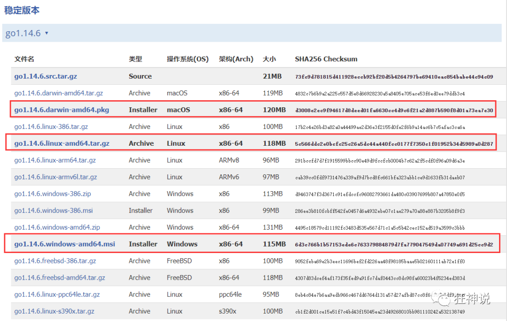

2、我这里是Window，所以直接下载windows的安装包来安装。

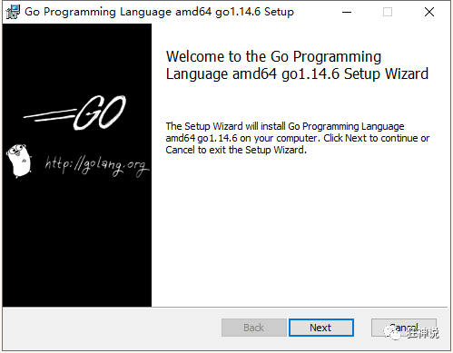

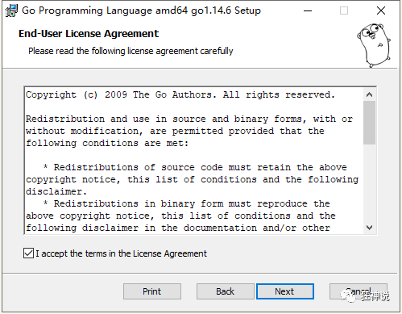

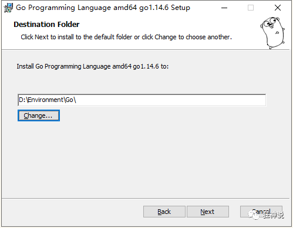

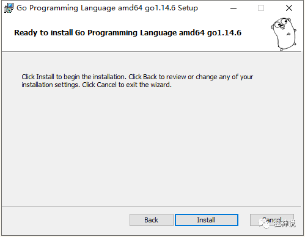

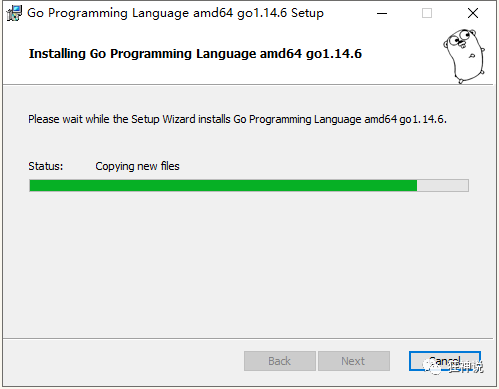

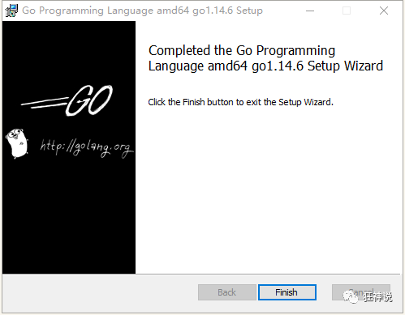

3、在控制台窗口输入“go version”可查看Go版本，检测是否安装成功。

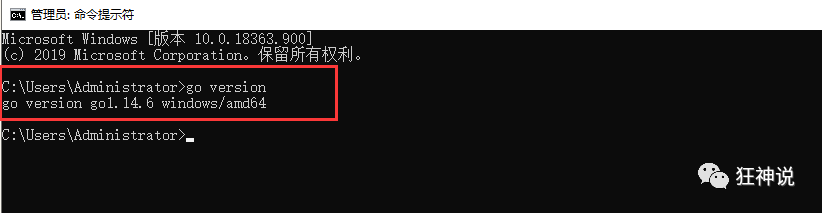

4、配置环境变量。Go需要一个安装目录，还需要一个工作目录。即GOROOT、和GOPATH。

GOROOT即为GO的安装目录。

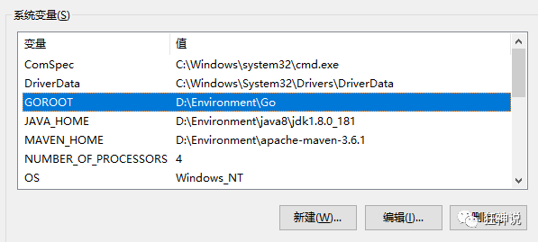

GOPATH即为存储Go语言项目的路径，可以自己进行设值，我放在了**GoWorks**自己建的，里面需要包含src、pkg、bin三个目录。

如果你下载的开发工具没有这些识别项，需要检查环境变量是否配置了Goworks。

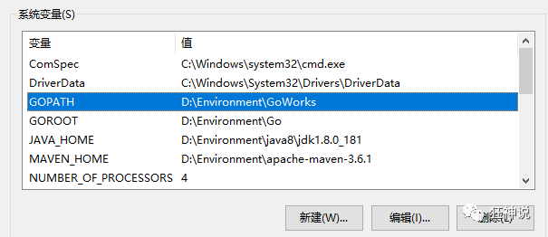

如果是安装包安装的，系统环境变量自动配置的，如果压缩包安装，需要在PATH配置Go的命令。

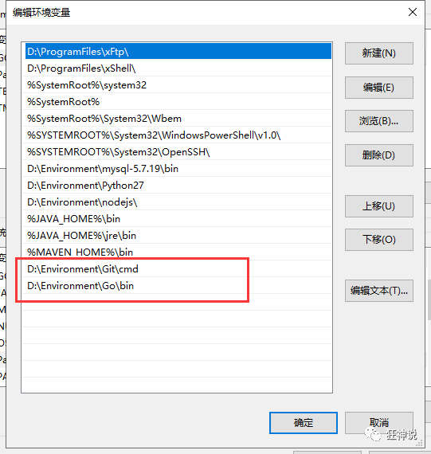

打开控制台，输入命令**go env**查看是否配置成功。

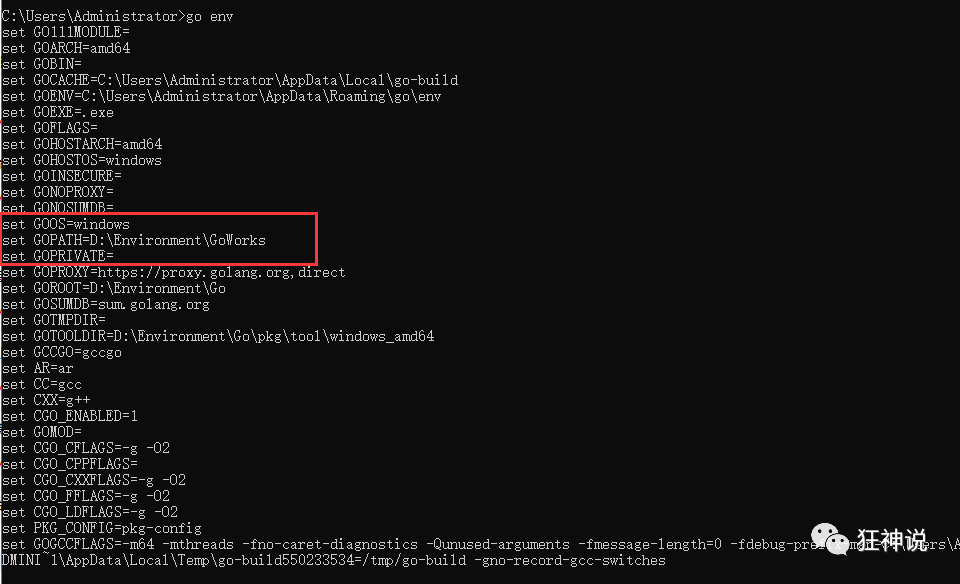

ok，到此，Go安装完成。

> 了解：GOPATH的目录结构（未来会慢慢理解）

一个Go语言项目的目录一般包含以下三个子目录：

 - src 目录：放置项目和库的源文件；
 - pkg 目录：放置编译后生成的包/库的归档文件；
 - bin 目录：放置编译后生成的可执行文件。

三个目录中我们需要重点关注的是 src 目录，其他两个目录了解即可，下面来分别介绍一下这三个目录。

**src 目录**

用于以包（package）的形式组织并存放 Go 源文件，这里的包与 src 下的每个子目录是一一对应。例如，若一个源文件被声明属于 log 包，那么它就应当保存在 src/log 目录中。

并不是说 src 目录下不能存放 Go 源文件，一般在测试或演示的时候也可以把 Go 源文件直接放在 src 目录下，但是这么做的话就只能声明该源文件属于 main 包了。正常开发中还是建议大家把 Go 源文件放入特定的目录中。

包是Go语言管理代码的重要机制，其作用类似于Java中的 package 和 C/C++ 的头文件。Go 源文件中第一段有效代码必须是package <包名> 的形式，如 package main。

另外需要注意的是，Go语言会把通过go get 命令获取到的库源文件下载到 src 目录下对应的文件夹当中。

**pkg 目录**

用于存放通过go install 命令安装某个包后的归档文件。归档文件是指那些名称以“.a”结尾的文件。

该目录与 GOROOT 目录（也就是Go语言的安装目录）下的 pkg 目录功能类似，区别在于这里的 pkg 目录专门用来存放项目代码的归档文件。

编译和安装项目代码的过程一般会以代码包为单位进行，比如 log 包被编译安装后，将生成一个名为 log.a 的归档文件，并存放在当前项目的 pkg 目录下。

**bin 目录**

与 pkg 目录类似，在通过go install 命令完成安装后，保存由 Go 命令源文件生成的可执行文件。在类 Unix 操作系统下，这个可执行文件的名称与命令源文件的文件名相同。而在 Windows 操作系统下，这个可执行文件的名称则是命令源文件的文件名加 .exe 后缀。


> 总结

1、找到Go语言的下载地址

2、安装Go语言环境

3、配置环境变量

4、GoWorks 配置

5、go version 查看版本   |     go env 查看所有的go环境变量

6、简单了解GoWorks 下面的三个目录作用。


## 下载开发工具 GoLand

下载地址：https://www.jetbrains.com/go/download/download-thanks.html


下载完成后，直接傻瓜式一路向下安装即可。

和装IDEA是一样的，好啦，环境搭建完毕，就可以开始Go语言的开发啦。

打不开的，激活

1、淘宝购买账号，9.9 一年

2、网上找激活码、一键激活   一个月

3、官方认证账号购买，很贵，但是正版！


**习惯推荐：尽量养成良好的习惯，未来电脑整洁，好寻找文件**

习惯、时间


创建项目的时候，建议创建到 goword/src 目录下，未来寻找都十分方便 D:\Environment\GoWorks\src\xuego

mac、默认自动都创建在 GoWorks\src\xuego


## Hello,World

记事本编写：hello.go

```go
package main

import "fmt" // 导入一个系统包fmt用来输出的

func main() {
    fmt.Println("Hello World!") // 打印输出helloworld字符串！
}
```

当前目录下执行：go run hello.go

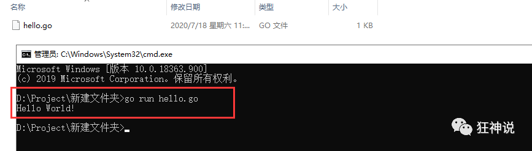


> 好啦，准备工作都做完毕后，我们就可以开始正式学习Go语言啦！

## 附录：HelloWorld详解

**package（创建包）**

Go语言以“包”作为管理单位，每个 Go 源文件必须先声明它所属的包，所以我们会看到每个 Go 源文件的开头都是一个 package 声明，格式如下：

`package name`

其中 package 是声明包名的关键字，name 为包的名字。和包同名，除了入口文件，main 固定的写法

Go语言的包与文件夹是一一对应的，它具有以下几点特性：

- 一个目录下的同级文件属于同一个包。
- **包名可以与其目录名不同。**

main 包是Go语言程序的入口包，一个Go语言程序必须有且仅有一个 main 包。如果一个程序没有 main 包，那么编译时将会出错，无法生成可执行文件。

**import（导入包）**

在包声明之后，是 import 语句，用于导入程序中所依赖的包，导入的包名使用双引号""包围，格式如下：

`import "name"`

其中 import 是导入包的关键字，name 为所导入包的名字。

代码第 4 行导入了 fmt 包，这行代码会告诉 Go 编译器，我们需要用到 fmt 包中的函数或者变量等，fmt 包是Go语言标准库为我们提供的，用于格式化输入输出的内容（类似于C语言中的 stdio.h 头文件），类似的还有 os 包、io 包等，后面我们会详细介绍。

另外有一点需要注意，导入的包中不能含有代码中没有使用到的包，否则Go编译器会报编译错误，例如 imported and not used: "xxx"，"xxx" 表示包名。

也可以使用一个 import 关键字导入多个包，此时需要用括号( )将包的名字包围起来，并且每个包名占用一行，也就是写成下面的样子：
```
import(
    "name1"
    "name2"
)
```

**main 函数**

代码的第 7 行创建了一个 main 函数，它是Go语言程序的入口函数，也即程序启动后运行的第一个函数。main 函数只能声明在 main 包中，不能声明在其他包中，并且，一个 main 包中也必须有且仅有一个 main 函数。
C/C++ 程序的入口函数也是 main()，一个 C/C++ 程序有且只能有一个 main() 函数。

main 函数是自定义函数的一种，在Go语言中，所有函数都以关键字 func 开头的，定义格式如下所示：
```
func 函数名 (参数列表) (返回值列表){
    函数体
}
```
格式说明如下：

- 函数名：由字母、数字、下画线_组成，其中，函数名的第一个字母不能为数字，并且，在同一个包内，函数名称不能重名。
- 参数列表：一个参数由参数变量和参数类型组成，例如 func foo( a int, b string )。
- 返回值列表：可以是返回值类型列表，也可以是参数列表那样变量名与类型的组合，函数有返回值时，必须在函数体中使用 return 语句返回。
- 函数体：能够被重复调用的代码片段。

注意：Go语言函数的左大括号{必须和函数名称在同一行，否则会报错。

**打印 Hello World**

代码的第 8 行 fmt.Println("Hello World!") 中，Println 是 fmt 包中的一个函数，它用来格式化输出数据，比如字符串、整数、小数等，类似于C语言中的 printf 函数。这里我们使用 Println 函数来打印字符串，也就是( )里面使用""包裹的部分。

注意，Println 函数打印完成后会自动换行，ln是 line 的缩写。

点号.是Go语言运算符的一种，这里表示调用 fmt 包中的 Println 函数。

另外，代码 fmt.Println("Hello World!") 的结尾，不需要使用;来作为结束符，Go 编译器会自动帮我们添加，当然，在这里加上;也是可以的。

## 附录：编译和运行

Go语言是编译型的静态语言（和C语言一样），所以在运行Go语言程序之前，先要将其编译成二进制的可执行文件。

可以通过Go语言提供的go build或者go run命令对Go语言程序进行编译：

- go build 命令可以将Go语言程序代码编译成二进制的可执行文件，但是需要我们手动运行该二进制文件；
- go run 命令则更加方便，它会在编译后直接运行Go语言程序，编译过程中会产生一个临时文件，但不会生成可执行文件，这个特点很适合用来调试程序。


因为之前我们已经配置好了环境变量，所以可以直接使用 Windows 自带的命令行工具（也叫 CMD 窗口或者命令提示符）来编译Go语言程序。微软后来对命令行工具进行了一次升级，并更名为 Powershell，power 是更加强大的意思。

> go build 命令

go build 命令用来启动编译，它可以将Go语言程序与相关依赖编译成一个可执行文件，其语法格式如下。

`go build fileName`

其中 fileName 为所需要的参数，可以是一个或者多个 Go 源文件名（当有多个参数时需要使用空格将两个相邻的参数隔开），也可以省略不写。

使用 go build 命令进行编译时，不同参数的执行结果也是不同的。

1) 当参数不为空时

如果 fileName 为同一 main 包下的所有源文件名（可能有一个或者多个），编译器将生成一个与第一个 fileName 同名的可执行文件（如执行 go build abc.go def.go ... 会生成一个 abc.exe 文件）；如果 fileName 为非 main 包下的源文件名，编译器将只对该包进行语法检查，不生成可执行文件。

2) 当参数为空时

如果当前目录下存在 main 包，则会生成一个与当前目录名同名的“目录名.exe”可执行文件（如在 hello 目录中执行 go build 命令时，会生成 hello.exe 文件）；如果不存在 main 包，则只对当前目录下的程序源码进行语法检查，不会生成可执行文件。

例子：`go build .\hello.go`

go build命令后面的参数中，.\表示当前目录。在Windows 系统中，当前目录使用.\表示；在类 Unix 系统（例如 Linux、MacOS 等）中，当前目录使用./表示。

注意，这里的go build 命令中 .\可以省略不写，不会影响编译。

另外，go build 命令只有在执行出错的情况下才会有返回信息，执行成功的话是没有返回信息的，但是会在当前目录生成一个与 main 包文件同名的 .exe 可执行文件，如下图所示。

> go run 命令

除了使用go build命令外，Go语言还为我们提供了go run命令，go run命令将编译和执行指令合二为一，会在编译之后立即执行Go语言程序，但是不会生成可执行文件。

go run 命令的语法格式如下：

`go run fileName`

其中 fileName 为所需要的参数，参数必须是同一 main 包下的所有源文件名，并且不能为空。

例子：`go run hello.go`

可以看到第 1 行的go run 命令执行后，直接在第 2 行输出了程序的运行结果。

go build 命令和 go run 命令还有很多其他的编译方法，我们将在后面为大家详细介绍。

## 附录： 常用的几种Print方式

> Print

```
输出到控制台(不接受任何格式化，它等价于对每一个操作数都应用 %v)
fmt.Print(str)
```
> Println
```
输出到控制台并换行
fmt.Println(tmp)
```
> Printf
```go
var a int = 1
var b int = 2
var c int = 3
只可以打印出格式化的字符串。只可以直接输出字符串类型的变量（不可以输出整形变量和整形 等）
fmt.Printf("%d",a)
fmt.Printf("a = %d, b = %d, c = %d\n", a, b, c)
```

在 Printf中，有一些常用的格式化占位符，我们在这里列出一下 ：

- %v 以默认的方式打印变量的值
- %T 打印变量的类型
- %s 正常输出字符串
- %t 打印true或false
- %p 带0x的指针
- %d 整型
- %#p 不带0x的指针
- %o 不带零的八进制
- %#o 带零的八进制
- %x 小写的十六进制
- %X 大写的十六进制
- %#x 带0x的十六进制
- %U 打印Unicode字符
- %#U 打印带字符的Unicode
- %b 打印整型的二进制
- %q 字符串带双引号，字符串中的引号带转义符
- %f (=%.6f) 6位小数点
- %e (=%.6e) 6位小数点（科学计数法）
- %g 用最少的数字来表示
- %.3g 最多3位数字来表示
- %.3f 最多3位小数来表示


### 2023.2.2日直播总结

1、了解了Go语言的发展史

2、go语言的特性

3、go语言的环境安装

4、goland工具的安装

5、helloworld程序的编辑和理解


## 作业

1、Go环境安装，了解go语言的几个命令  version  env   run  build

2、goland工具的安装，保证可以使用

3、helloworld 程序理解，了解什么是入口程序，并举一反三，写三到五个案例测试

4、附录内容可以阅读测试。


