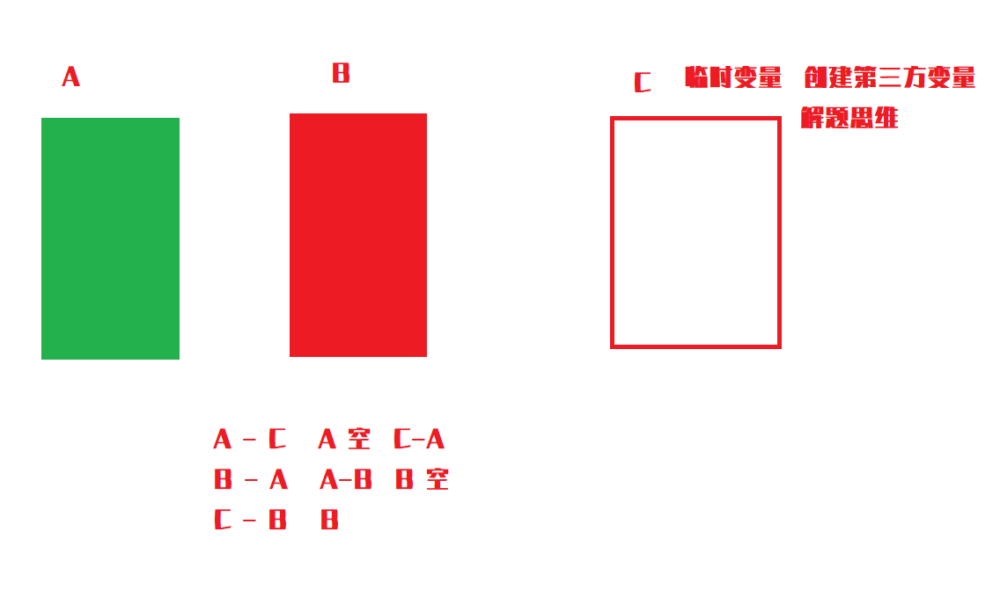
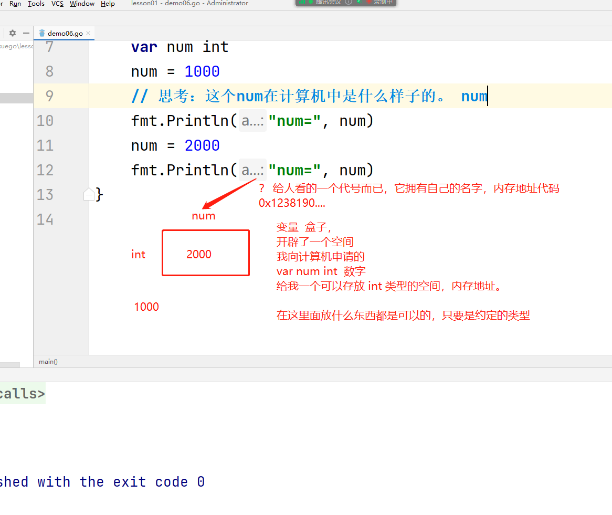

## Go语言基础语法

> 上节课关于程序启动的回答。

// 关于Goland 中 执行的问题
// 1、包下执行 （一个 main 函数来执行，如果有多个，无法直接执行）
// 2、Go文件执行 （直接启动即可，在main函数外面执行）


## 注释

我们为什么写注释？

一个项目，是很多组成的。写的时候，你能看懂的。   半年、一年 （时间久了，自己写代码看不懂了）

对接、项目很多时候都是多人协作完成。（很难沟通，直接读懂代码是比较困难）

在刚开始学习的时候，不喜欢写注释。

什么是注释： 来描述我当前这个代码是做什么的，或者一些批注

```go
package main

import "fmt"

// 注释是不会被程序执行的

// // 单行注释
// 注释主要是针对一些自己不太理解的业务，或者复杂的业务。开源项目中，注释十分完善。

/* 多行注释
。。。。。。
写自己的理解和当前代码作用
*/
func main() {
	
	fmt.Println("Hello,World！")

}
```

以helloworld为例：

```go
// 代表是main包，下面如果存在 main 函数，那么就是程序的入口
package main

// 导入了一个 fmt 包，可以通过它来调用打印函数、输出一行话....
import "fmt"

// main函数  func 函数  main 函数的名字 () 没有参数
func main() {
   // 打印了一句helloworld
   fmt.Println("Hello,World！")

}
```

**写注释是一个十分良好的习惯，我们都应该按照要求给自己代码写好注释，为了自己，也为了他人。很多大公司里也是对注释有严格要求的。**


## 变量

### 变量的定义

程序 ： 我们向电脑说了一段话，需要电脑才能理解 （沟通机制 ，xxx语言 -- 汇编 -- 机器码）

电脑实际上识别的是机器码 ：  0  1  1  1  0  1   （高低电频）

机器码 ：  穿孔纸带 

汇编：早些时候，现在的很多机器硬件底层代码，都是汇编

人能读懂的代码：英文、中文

将我们的语言和机器进行对接 （C、Java、Go ---> 编译器 -->  计算机中去执行：无需理解的，我们只需要写我们能看懂的代码即可 ）


我们理解的世界、和计算机的世界要一一对应：

定义：一切都是需要去定义的。

计算机也需要去定义一些东西。

人名：  名字    name =  秦疆   字符串。

名字（变量）

name = 张三

name = 李四 


计算机也需要这样来认识我们写的代码，也需要一个格式

通过 var 关键字来定义变量

变量名字   需要告诉计算机这个信息（变量）是什么类型的，数据类型：数字、字符串、小数.... = "变量的值"

```go
//用程序描述一个人的信息
// string 字符串类型
var name string = "秦疆"
// int 数字类型
var age int = 27

var sex string = "男"

// Java
String name = "秦疆"
```


**公式：定义变量  var 变量名 变量类型 **


```go
package main

import "fmt"

func main() {
   // var 变量名 变量类型
   // 定义变量 ，如果没有给这个变量赋值， 就是这个数据类型的默认值。
   // string 默认值 ”“  int 默认值 0
   var name string
   var age int

   // 可以同时定义多个变量，也只需要使用 var() 关键字
   var (
      addr  string
      phone int
   )

   // goland 快捷键 ： 复制当前行到下一行  Ctrl + D
   fmt.Println(name)
   fmt.Println(age)
   fmt.Println(addr)
   fmt.Println(phone)

   // 变量的使用，在定义完毕变量之后直接可以操作这个变量
   // 给变量赋值 ，符号  = 赋值（不能叫等于）
   // 将 "秦疆" 赋值 给 name 这个变量。
   name = "秦疆"
   // 使用变量，直接打印或者进行一些操作都可以
   fmt.Println(name)

   // 变量是可以被重复赋值的，变量。
   name = "张三"
   fmt.Println(name)

   // 在定义变量的时候直接进行赋值。
   var dog string = "旺财"
   fmt.Println(dog)

}
```


> 短变量的申明方式（语法糖，方便开发人员开发）

```go
package main

import "fmt"

func main() {

   // 只定义变量，不使用可以吗. 理论可以，实际在Go语言中不行。
   // 无意义代码，报错！

   // 问题1 ：能不能不写数据类型
   // 问题2 ：不用var 直接定义变量呢？

   // 自动推导，一个短变量声明
   name := "kuangshen"
   age := 18
   // 语法糖（偷懒，简化开发！）
   // := 相当于快递定义变量。如果给这个变量赋值了，那么会自动推导它的类型
   // var 、 数据类型的定义都被省略的。
   // 数据类型 go语言中基本的数据类型。

   fmt.Println(name)
   fmt.Println(age)

   // 定义了变量name2
   var name2 string
   // 在快速声明中，如果 := 左边的变量已经存在了，那么它将无法创建，无法重新定义
   name3 := "qinjiang222"
   fmt.Println(name2)
   fmt.Println(name3)
   name3 = "zhangsan666"
}
```


> 小结

1、定义变量使用定式    var 变量名称  变量数据类型

2、给变量赋值 。 定义的时候直接赋值、  通过变量名来赋值、

3、语法糖  ：=  。 可以通过它来快速定义变量，如果是基本数据类型，字符串、数字，它会自动推导类型


所谓的基础语法，所有的编程语言大同小异。


### 变量的交换



```go
package main

import "fmt"

func main() {
   /* 在编程中遇到的第一个问题：变量交换
   var a int = 100
   var b int = 200

   var t int
   t = a
   a = b
   b = t
   */
   // 在Go语言中，程序变量交换，也有语法糖
   var a int = 100
   var b int = 200
   // fmt.Println 可以传递多个参数，用逗号隔开，直接打印
   fmt.Println("a=", a, ",b=", b)
   // 把a,b赋值给b,a  语法糖, 底层本质还是用到了临时变量。简化我们的开发
   b, a = a, b
   fmt.Println("交换后 a=", a, ",b=", b)
   
   // 复杂的问题都给我们简单化了，我们开发很轻松，编译器帮我们在底层处理。
}
```


### 理解变量（内存地址）



```go
package main

import "fmt"

func main() {
   // 变量到底是个什么玩意？
   // num 实际上是一片内存空间
   // 我们想要看一个变量的内存地址，只需要在变量名前加上 & 即可。
   // 取地址符 （指针）
   var num int
   num = 1000
   // 思考：这个num在计算机中是什么样子的。 num
   fmt.Printf("num的值:%d,内存地址:%p\n", num, &num)
   num = 2000
   fmt.Printf("num的值:%d,内存地址:%p\n", num, &num)

   // 汇编。理解一切

   var name string
   name = "张三"
   // 思考：这个num在计算机中是什么样子的。 num
   fmt.Printf("num的值:%s,内存地址:%p\n", name, &name)
   name = "李四"
   fmt.Printf("num的值:%s,内存地址:%p\n", name, &name)

   // 打印内存地址的方式之一。 Print  f格式化输出
   // 内存
   // 第一个参数 输出字符串
   // % 占位符。
   // 占位符的数量，要和后面待输出的数量一直
   // %d 数字 int d
   // %p 内存地址，num需要取出变量的地址。
   // %s 字符串。
   // \n 换行
   //fmt.Printf("num的值:%d",num)
}
```

num = 0xaaaaaaaa

更多关于汇编和二级制以及计算机底层内存本质的科普看我往期视频 ： https://www.bilibili.com/video/BV1ni4y1G7B9


### 匿名变量

```go
package main

import "fmt"

// 变量 ( 有名字、没有名字：匿名 )
// 十分特殊、匿名变量 （黑洞，一切东西丢进去，任何赋值给匿名变量的值都会被丢弃）
// _ 下划线，就是匿名变量在Go语言中

// 函数 一段代码的集合。
//
// func  test 函数名 （参数,参数....） 返回一些东西{
//  一段代码的集合，通过or不通过参数，返回结果
// }
//
// 基本的操作函数，调用函数，返回两个数字。
func test() (int, int) {
   // return 返回结果
   return 100, 200
}

// 在Go语言中会大量使用到
// 匿名变量不占用内存空间，不会分配内存。
func main() {
   // 调用这个test函数，应该会返回两个结果，100,200

   // 变量 ： 除了直接定义之外，还可以是一个结果的赋值
   //var a int = 100
   // 只想要test返回的第一个结果,这时候就需要使用匿名变量 _。
   a, _ := test() // a,b := 100,200
   fmt.Println(a)
   // 只想要test返回的第二个结果,这时候就需要使用匿名变量 _。
   _, b := test()
   fmt.Println(b)
}
```


### 变量的作用域

```go
package main

import "fmt"

// 全局变量：在当前go文件中生效...
// 定义在go文件非函数内，在package和import下面
// 全局变量的定义必须使用 var 关键字, 如果直接使用 := 则无法创建该变量
// 全局变量和局部变量是可以重名的，优先级。到底用谁
var c int

func main() {
   // 局部变量：只在一定的范围内生效...
   // 在函数体内声明变量
   var a int = 3
   var b int = 4
   // 如果全局变量有，那么直接使用全局变量来接收。
   c = a + b
   fmt.Printf("a=%d,b=%d,c=%d\n", a, b, c)
   fmt.Printf("c内存地址:%p\n", &c)
   b = 1
   // 但是如果在局部有和全局同名的变量，优先使用局部变量
   c := a + b
   fmt.Printf("a=%d,b=%d,c=%d\n", a, b, c)
   fmt.Printf("c内存地址:%p\n", &c)
   b = 5
   // 就近原则
   c = a + b
   fmt.Printf("a=%d,b=%d,c=%d\n", a, b, c)
   fmt.Printf("c内存地址:%p\n", &c)

   // Printf 格式化输出 (参数一：需要打印的内容，%是占位符，通过后续参数给他一一赋值)
   fmt.Printf("a=%d,b=%d,c=%d\n", a, b, c)
}
```

就近原则

```go
package main

import "fmt"

// Go语言程序中全局变量与局部变量名称可以相同，但是函数体内的局部变量会被优先考虑。
// string  int   float64  浮点数（小数）
var a float64 = 3.14

func main() {
   var a float64 = 2.18
   fmt.Println(a)
}
```


### 常量

常量： 不能变化的量。  这个变量是一个特殊的变量，无法改变的。 关键字  **const**

两个区别：变量的定义使用 var 、常量的定义是使用const

是什么机制导致他无法改变的？

Go语言底层的约定，实际上它是可以改变的，需要跳过常量名，直接找到内存地址，进行修改值。

```go
package main

import "fmt"

// 常量和变量放置的内存地址不同  （栈、堆、常量池）
// 程序正常执行,压栈

// 常量
func main() {
   // 规定：建议这么去做
   // 我们通过定义常量的时候，建议大家使用大写字母来定义。区分与普通变量
   // 一旦定义之后是不会发生变化的。
   // 定义格式  const 常量名[type] = value
   const URL string = "www.kuangstudy.com"

   // 隐式定义 常量的自动推导是可以省略一些基础类型，
   const URL2 = "www.baidu.com"

   // 可以同时定义多个常量
   const URL3, URL4 string = "www.kuangstudy.com", "www.baidu.com"

   //
   fmt.Println(URL)
   fmt.Println(URL2)
   fmt.Println(URL3)
   fmt.Println(URL4)

   // 在我们真实的世界也是有很多不会发生变化量，那在程序中对应的就是常量
   const PI = 3.14
   // 固定的东西，都建议统一定义成常量。
   const LENGTH int = 8000
   const WIDTH int = 8000

   // 常量是无法被修改的。
   //LENGTH = 13

   fmt.Println(LENGTH)

}
```


## 2023.2.4日 总结

1、注释，给自己看也给别人看，良好习惯

2、变量的定义  var  变量名 变量类型 

3、变量的赋值 变量  = 变量值

4、变量定义的语法糖  ：=  ，只能用在变量中，可以自动推导基本数据类型、只能用在局部变量中

5、变量的本质- 内存空间 

6、匿名变量 _

7、变量的作用域 ：全局变量、局部变量 （同名-就近原则）

8、常量的定义和场景 （const）无法修改的值才会设置为常量，方便使用，通常使用大写


> 作业：

1、定义变量，然后画出内存图来理解什么是变量

2、尝试使用  ：= 定义5-10个变量来体验

3、如果是其他语言过来的人 ， 定义变量尝试多理解和习惯 （有其他经验的人）

4、变量作用域的就近原则测试

5、匿名变量体验测试 （在后面开发中大量用到）

6、找寻生活中的10个常量数值，用程序定义并打印出来

7、尝试学会使用 printf 函数。


> 拓展：不建议大家做的，有想法的人去做

1、计算机的基本执行汇编原理 

2、程序运行中的栈堆

https://www.bilibili.com/video/BV1ni4y1G7B9


