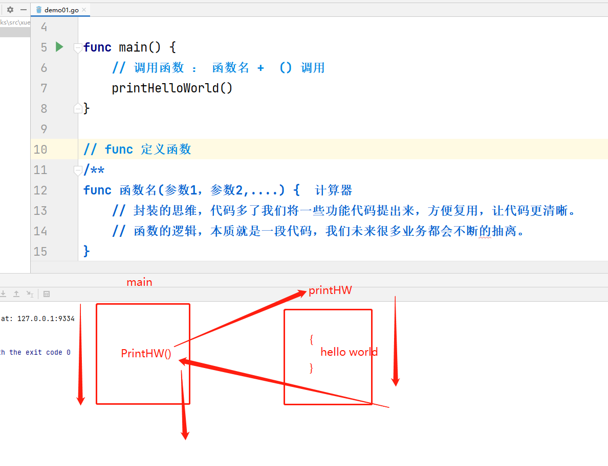
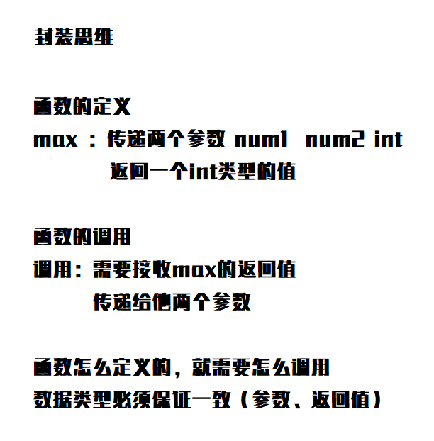
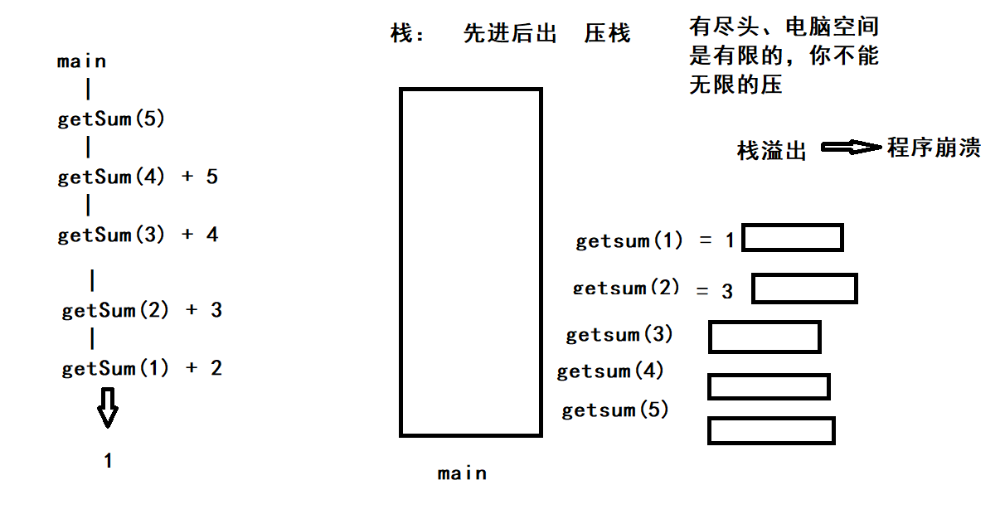

## 上届回顾

流程控制

- 判断
  - if
  - swtich
- 循环
  - for

键盘输入  fmt.scan

### 作业讲解

**leetcode 、用编程去解决一些数学问题。数据结构、算法。**

- **拆分问题，将问题改为可以通过程序来实现的逻辑**
- **if     for  解决问题**
- **提高性能（执行时间更快）**


九九乘法表：

```go
package main

import "fmt"

// 九九乘法表

// 1、9行 ： 输出9行
// 2、第一行1个、第二行2个、递增 i++
// 3、第一个参数横向 1....9   第二个参数纵向 1....9
func main() {
   for i := 1; i < 10; i++ {
      // 第一行1个 第二行2个、递增 i++
      for j := 1; j <= i; j++ {
         fmt.Printf("%d * %d = %d   ", j, i, i*j)
      }
      fmt.Println()
   }
}
```


打印菱形

```go
package main

import "fmt"

/*
*
1、分析问题

  - 1
    ***  3
    ***** 5   2n-1
    *******
    *********

***********

2、拆分问题，将问题拆分为可以用编程来实现的逻辑
1） 两个三角形构成的菱形 （对称的）
2） 上面的正三角形应该比下面的倒三角型多一行
3） 正三角形，每一行前面的空格在减少
4)  * 是 1/3/5递进
*/
func main() {

   //1、打印上面那个三角形
   for i := 1; i <= 6; i++ {
      // 如何递减实现空格 5  4  3  2  1
      for j := 1; j <= 6-i; j++ {
         fmt.Print(" ")
      }
      // i         1 2 3 4 5 6
      // 实现三角形 1 3 5 7 9 11   2i-1
      // 第一行  *    需要循环1次
      // 第二行 ***   需要循环3次
      // 第三行 ***   需要循环5次
      for j := 1; j <= 2*i-1; j++ {
         fmt.Print("*")
      }
      // 换行
      fmt.Println()
   }
   // 第二个三角形，倒三角
   /**
   *********
    *******
     *****
      ***
       *
   */
   // 5 4 3 2 1 0
   for i := 5; i >= 1; i-- {
      // 如何递增实现空格 1 2 3 4 5
      for j := 1; j <= 6-i; j++ {
         fmt.Print(" ")
      }
      // 实现三角形 1 3 5 7 9 11   2i-1
      // 第一行  9    需要循环9次
      // 第二行  7   需要循环7次
      // 第三行  5   需要循环5次
      for j := 1; j <= 2*i-1; j++ {
         fmt.Print("*")
      }
      fmt.Println()
   }

}
```


## Go语言中的函数（重点）

**入门简单精通难**

**函数式编程**

### 什么是函数

- 函数就是一段代码的集合
- go语言中至少要有一个 main函数
- 函数需要有一个名字，独立定义的情况下。见名知意 
- 函数可能需要有一个结果，也可能没有

```go
func printHelloWorld() {
   fmt.Println("Hello,world")
}
```



**函数和方法完全是不一样的东西，面向对象里面才有方法**

### 函数的具体定义

- 无参无返回值
- 有一个参数的函数
- 有两个 or 多个参数的函数
- 有一个返回值的函数
- 有两个 or 多个返回值的函数

```go
package main

import "fmt"

/*
*
- 无参无返回值
- 有一个参数的函数
- 有两个 or 多个参数的函数
- 有一个返回值的函数
- 有两个 or 多个返回值的函数
*/
func main() {
   m := max(123123123, 12312312312312)
   fmt.Println(m)
}

/*
func 函数名(参数1,参数2) 返回值类型 {
   // 代码逻辑

   return xxx
}
*/
// 定义一个稍微复杂一点的函数
// 比大小的函数 max ，两个数字比大小
// max函数，需要两个参数，int 类型的，比完大小之后我希望返回大的那一个数值
func max(num1 int, num2 int) int {
   var result int
   if num2 > num1 {
      result = num2
   } else {
      result = num1
   }
   // return返回结果
   return result
}
```



### 多个返回值（重点）

```go
package main

import "fmt"

func main() {
   a, b := swap("feige", "kuangshen")
   fmt.Println(a, " ", b)
}

// 返回多个返回值的函数定义
// 案例：交换两个string
// 有多个返回值的情况下，返回值用括号括起来
func swap(x string, y string) (string, string) {
   return y, x
}
```

多个返回的案例

```go
package main

import "fmt"

func main() {
	_, _, _, r4 := fun2(2, 4)
	fmt.Println(r4)
}

// 周长、面积案例  （长方形 ... 长、宽）
// 返回多个值，需要括号，需要表明返回值类型，返回值也可以命名
// return的结果值命名和定义函数返回值的命名无关.
func fun1(len, wid float64) (zc float64, area float64) {
	area = len * wid
	zc = (len + wid) * 2
	fmt.Println("zc:", zc)
	fmt.Println("area:", area)
	// 1、return 如果直接定义了，那么返回结果按照 return 的顺序
	// 2、直接调用return不带结果，那么则返回 函数返回值定义的顺序进行结果返回。
	return
}

func fun2(len, wid float64) (float64, float64, float64, float64) {
	area := len * wid
	zc := (len + wid) * 2
	fmt.Println("zc:", zc)
	fmt.Println("area:", area)
	// 1、return 如果直接定义了，那么返回结果按照 return 的顺序
	// 2、直接调用return不带结果，那么则返回 函数返回值定义的顺序进行结果返回。
	return area, zc, 1, 3
}
```

工具：怎么用看自己


### 可变参数

```go
package main

import "fmt"

func main() {
   fmt.Println(getSum())
}

// 可变参数： 一个函数的参数类型确定，参数的个数不确定，可以使用可变参数
// 可变参数如果有多个参数必须放在最后一个参数

// 求和 , 参数是可变的，int
func getSum(nums ...int) int {
   sum := 0
   fmt.Println("可变参数的长度为：", len(nums))
   for i := 0; i < len(nums); i++ {
      fmt.Println("可变参数", i, ":", nums[i])
      // 取出来
      //sum = sum + nums[i]
      sum += nums[i]
   }
   return sum
}

// 接收多个参数 nums 可变参数
// 使用下标来接收，下标是从0开始的
// nums : 100,200,300,400,500
// nums[0] = 100
// nums[1] = 200
// nums[2] = 300

// 了解传递了多少个数字  len()函数，获取可变参数的长度
```


### 参数的传递细节（留空）

- 引用传递 （ 切片 ）
- 值传递 ( 数组 )


### 函数中作用域

```go
package main

import "fmt"

// 函数作用域
// 局部变量
// 1、函数内部定义的变量，只能在函数内部调用
// 全部变量(全局变量)
// 1、函数外部定义的变量,默认我们定义在上面，方便文件统一查看和管理全局变量
var num int = 1

func main() {
	temp := 100
	// 定义一个只在 if 中生效的变量 if 临时变量(a,b := 1,2);条件判断{}
	// 小作用域可以用到大作用域中的变量，反之则不行。
	// 对于很多一次性的变量，都可以这么写
	if a := 1; a <= 10 {
		fmt.Println(temp)
		fmt.Println(num)
		fmt.Println(a)
		// 就近原则
		if a := 2; a <= 10 {
			fmt.Println(a)
		}
	}
	fmt.Println(num)
}

func f1() {
	fmt.Println(num)
}
func f2() {

}
```


### 递归函数（小难点）

```go
package main

import "fmt"

/*
定义：一个函数自己调用自己，就叫做递归函数
注意：递归函数需要有一个出口，逐渐向出口靠近，没有出口就会形成死循环。
*/
func main() {
	// overflows 栈溢出
	sum := getSum2(1000000000)
	fmt.Println(sum)
}
func getSum2(n int) int {
	fmt.Println(n)
	if n == 1 {
		return 1
	}
	return getSum2(n-1) + n
}

// 假设 getSum(5)

// 求和 sum  1 + 2 + 3 + 4 + 5
// getSum(5)☟=15
//      getSum(4)☟=10 + 5
//          getSum(3)☟=6 + 4
//               getSum(2)☟=3 + 3
// //                getSum(1)=1 + 2

```




### 回顾今日

- 作业：如何面对一些简单题目
  - 分析需求
  - 拆分需求（if、for实现的一个逻辑）
  - 按照自己拆分的步骤，逐步实现

- 什么是函数。函数定义
- **多个返回值的函数**
- **多个参数、可变参数 .....**
- 参数的作用域（ 小范围的可以用大范围的变量，反之则不行 ）
- **递归函数（函数自己调用自己，用假设法来解决问题，可能会导致 overflow .... ，递归是需要有尽头）**


#### 作业：

**使用递归实现 斐波那契数**

**预习：后面周六的内容，看点播！**


周六的直播内容：

### defer延迟函数

### 函数的数据类型

### 函数的本质

### 匿名函数

### 回调函数

### 闭包


