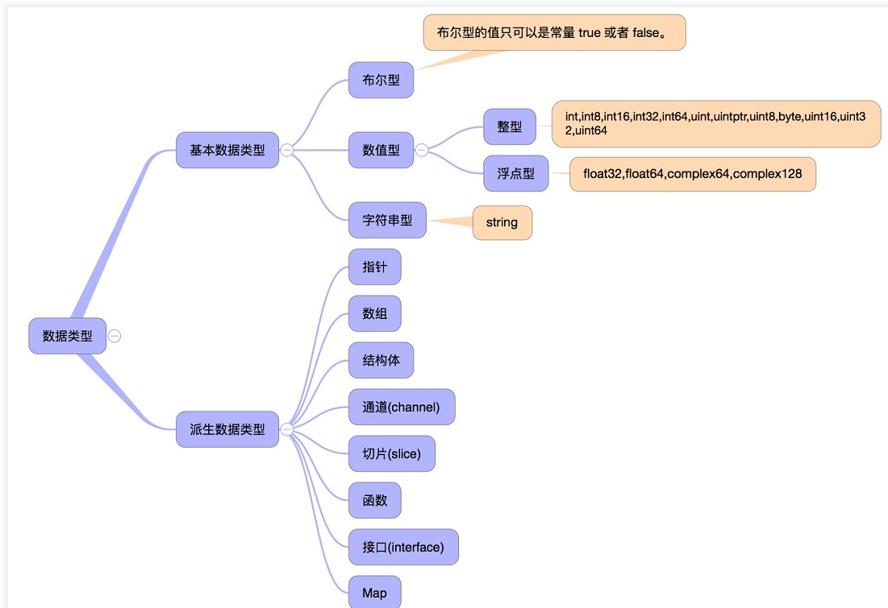
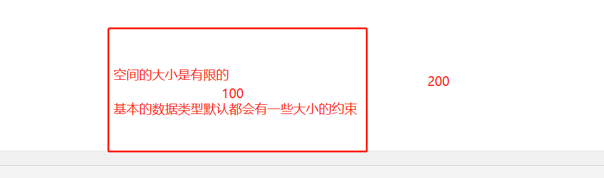
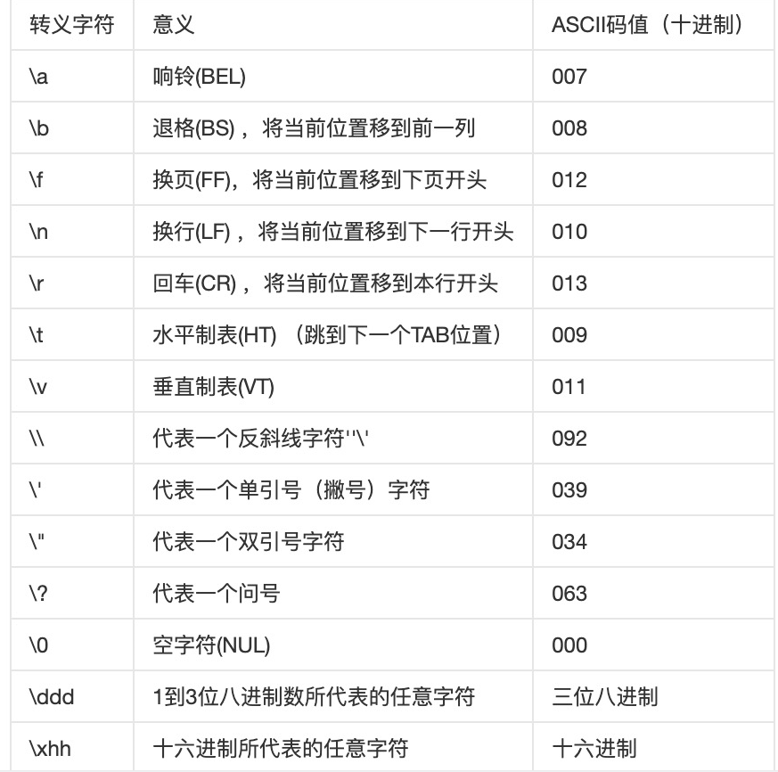
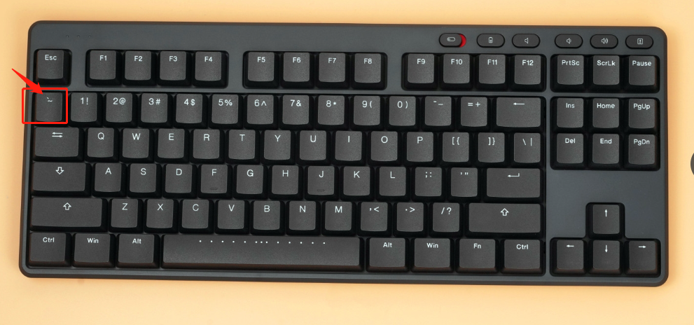

## 2023.2.5 祝大家元宵快乐！

## 昨日回顾

- 注释
- 变量的定义  var
- 变量的交换  temp
- 变量本质（内存地址）
- 匿名变量  _
- 变量的作用域
- 常量 const


### 特殊的常量 iota (拓展)

```GO
package main

import "fmt"

// 特殊的常量 iota 常量计数器，const （多个常量，自动帮我们 + 1）
func main() {
   // iota 每次定义新的常量，在一组 const 中，那么它会自动 + 1
   // iota 默认值0,
   const (
      a = iota
      b = iota
      c = iota
      d = 0
      e = iota
      // 如果在定义 const 的时候，如果下面的常量没有赋值，默认沿用上面一个常量定义的赋值。
      f
      g
      h = iota
      // ... 1000+
   )
   const (
      i = iota // 0
      j = 0    // j =0  iota + 1 = 1
      k = iota // iota + 1 = 2
   )
   // 0 1 2  d=0 ，e = 4
   fmt.Println(a, b, c, d, e, f, g, h)
   fmt.Println(i, j, k)

}
```


变量的定义 ： var  变量名  type（数据类型）

字符串  string

数字整数    int

小数 浮点数   float64  /  float32


## 数据类型

动态类型编程语言

- 运行时判断

静态类型的编程语言 ： Go 、C 、

- 在开发的时候，就需要给一些定义的变量赋值空间大小。C 需要自己去开辟这个空间

数据类型 ： 每种在Go语言中出现的**基本数据类型**，会有一个默认的空间大小。




### 布尔数据类型

布尔型的值只可以是常量 true 或者 false。一个简单的例子：var b bool = true。

```go
package main

import "fmt"

func main() {
   // bool类型，只有两个值 true 和 false。  对和错
   // 定义变量  bool 布尔类型的定义 与 int、string 都是Go语言中基本数据类型。
   var b1 bool
   var b2 bool

   b1 = true
   b2 = false
   // f 格式化输出  %d 整数  %s 字符串 %p内存地址  %T 类型 %t bool值
   fmt.Printf("b1=%T,%t\n", b1, b1)
   fmt.Printf("b2=%T,%t\n", b2, b2)

   // 比大小
   var a int = 1
   var b int = 2
   // 如果  xxx  否则 xxx
   // 结果就是bool类型
   fmt.Println(a > b)
   if a > b {
      fmt.Println("a是大于b的")
      // .....
   } else {
      fmt.Println("a是小于b的")
   }

   // bool 类型的默认值 false， 规定  false  0   true = 1
   var b3 bool
   fmt.Println("bool默认值：", b3)

}
```


### 数字型 int

整型 int 和浮点型 float32、float64，Go 语言支持整型和浮点型数字，并且支持复数，其中位的运算采用补码。

> Go 也有基于架构的类型，例如：uint 无符号、int 有符号

每个数字，都是有**范围**的， 有的数字只能大于0

有的数字可以小于0

在计算机中，所有的东西最终都是存在内存当中的，所以我们不能无限的放置东西（数字）

| 序号 | 类型和描述                                                   |
| :--- | :----------------------------------------------------------- |
| 1    | **uint8** 无符号 8 位整型 (0 到 255)                         |
| 2    | **uint16** 无符号 16 位整型 (0 到 65535)                     |
| 3    | **uint32** 无符号 32 位整型 (0 到 4294967295)                |
| 4    | **uint64** 无符号 64 位整型 (0 到 18446744073709551615)      |
| 5    | **int8** 有符号 8 位整型 (-128 到 127)  0                    |
| 6    | **int16** 有符号 16 位整型 (-32768 到 32767)                 |
| 7    | **int32** 有符号 32 位整型 (-2147483648 到 2147483647)       |
| 8    | **int64** 有符号 64 位整型 (-9223372036854775808 到 9223372036854775807) |



1、有符号数和无符号数的区别

- 0为分解，正负推进.......空间大小   ，空间大小是根据位来判断的  int 8 16 32 64、二进制的位，这个数据类型值的上限
- 0 + 空间大小

2、了解 二进制基本原理

3、尝试自己推算出每个整数数据类型的大小上限值。

int

### 浮点型

浮点数 float ：float32   float64 ，也是一个空间的大小。

```go
package main

import "fmt"

// 浮点数 float ，默认是 float64 ，32
func main() {
   // 浮点数是不精确的,计算机底层导致的 0 1、浮点数、复数，没办法做到精确计算
   var f1 float64
   f1 = 3.16
   var f2 float32
   f2 = 5
   fmt.Println(f1)
   // // 默认的 float 类型，都是保留了6位小数
   // 浮点数的格式化输出 %f ，都是保留了6位小数,保留2位或者3位怎么实现
   // .3 保留3位小数 其余类推
   // 如果小于了当前保留的位数，四舍五入
   fmt.Printf("%T,%.1f\n", f1, f1)
   fmt.Printf("%T,%f", f2, f2)

}
```

验证：浮点数计算时不精确的

```go
package main

import "fmt"

func main() {
   // 浮点数 ； 符号位  + 指数位 + 尾数位（存储过程中,可能会丢失，造成精度损失）。
   // float64 的空间 > float32
   var num1 float32 = -123.0000901
   var num2 float64 = -123.0000901
   fmt.Println(num1)
   fmt.Println(num2)
   // 结论：
   // 1、使用float来计算，可能导致数据不精确。
   // 2、float64的精度>float32， go语言中，浮点数默认使用的是float64
}
```

通常情况下，关于浮点数、默认使用 float64 。


### 特殊的数字类型

```go
package main

import "fmt"

// byte
func main() {
   // 别名uint8是byte，十分常用
   // byte = uint8 （0-255之间的整数，我们通常使用byte来定义） uint8
   var num1 byte = 255
   fmt.Println(num1)
   fmt.Printf("%T\n", num1)

   // 不经常用 rune int32
   var num2 rune = 1000000000
   fmt.Println(num2)
   fmt.Printf("%T\n", num2)

   // int、系统大小来的，32位  32、64默认是64
   // 软件跑在32位系统上是不兼容的
   var num3 int = 100000
   fmt.Println(num3)
   fmt.Printf("%T\n", num3)
}
```

64位的操作系统是可以兼容32位的、32为不能跑64位的软件。 寻址空间。


### 字符串类型

字符串就是一串固定长度的字符连接起来的字符序列。  一段中文或者英文 （编码- 字符）

Go语言中，所有的字符串都是由单个 字符 连接起来的。兼容全世界文字的

> 拓展：了解编码表

UTF-8编码 ， 目前兼容我们绝大部分的文字和符号。

GBK编码：中国的编码表，号称兼容所有的中文汉字。

Unicode编码表 ：号称兼容了全世界的文字。

编码  中   本质是一个数字

```go
package main

import "fmt"

func main() {

   var str string
   str = "Hello,World"
   fmt.Printf("%T,%s\n", str, str)
   // H E L L O , W O R L D
   // Go语言中，所有的字符串都是由单个 字符 连接起来的。
   // 单引号是字符、双引号才是 string 类型
   // 字符本质是整型
   v1 := 'A'
   v2 := "A"
   fmt.Printf("%T,%d\n", v1, v1)
   fmt.Printf("%T,%s\n", v2, v2)

   v3 := '魑'
   fmt.Printf("%T,%d\n", v3, v3)
}
```


转义字符

```go
package main

import "fmt"

func main() {
   // 特殊的字符 转义字符 \n
   // \n 换行
   fmt.Println("hello\nworld")
   // \b   backspace  删除上一个字符
   fmt.Println("hello\bworld")
   // \t  Tab
   fmt.Println("hello\tworld")
}
```




多行输入使用 ``



```go
package main

import "fmt"

func main() {
	// 特殊的字符 转义字符 \n
	// \n 换行
	fmt.Println("hello\nworld")
	// \b   backspace  删除上一个字符
	fmt.Println("hello\bworld")
	// \t  Tab
	fmt.Println("hello\tworld")

	// 转义，就是可以将特殊转义符号或者一些符号打印出来 \

	// ` ` 可以通过它来定义一些长字符串，可以换行输入
	fmt.Println(`\\n
        sadad
        asd
        a
        sd
        asda
        sd
        asda`)
}
```


### 数据类型的转换

在必要以及可行的情况下，**一个类型的值可以被转换成另一种类型的值**。

**由于Go语言不存在隐式类型转换，因此所有的类型转换都必须显式的声明： A = A(B)**

```go
package main

import "fmt"

// 类型转换
func main() {
   // 数据类型转换在Go中就一个格式
   // 新类型的值 = 新类型（旧类型的值）

   // 高位向低位转 （int64  int32  int16）
   
   // 浮点数转整数，截断，只保留整数部分
   a := 5.9    // float
   b := int(a) // b 就是int类型的a = 5

   fmt.Printf("%T,%.1f\n", a, a)
   fmt.Printf("%T,%d\n", b, b)

   c := 1
   d := float64(c)
   fmt.Printf("%T,%d\n", c, c)
   fmt.Printf("%T,%f\n", d, d)

   // 布尔类型转换，布尔类型 是不支持类型转换的。
   //var flag bool = true
   //f := int(flag)
   
}
```


变量的定义： var  变量名  **数据类型**

数据类型 是没有上限的，以上的都是基本数据类型，常用的，系统自带的，必要的。任何一个编程语言都会有。


除了这些之外，会存在一些自己开发的数据类型（数据结构都是可以自己定义的）


## 运算符

### 算术运算符

```go
package main

import "fmt"

func main() {
   // 算术运算符 + - * / % ++ --
   var a int = 7
   var b int = 3
   var c int // 结果
   // 双元运算符，由两个变量参与运算，或者多个
   c = a + b
   fmt.Println(c)
   c = a - b
   fmt.Println(c)
   c = a * b
   fmt.Println(c)

   c = a / b // 除 7/3 = 2...1
   fmt.Println(c)
   c = a % b // 取模 余数  1
   fmt.Println(c)

   // 单元运算符，用自己就可以操作得出结果
   //  自增++  自减--
   fmt.Println(a)
   a++ // a = a + 1 自增，在自己的基础上 + 1
   fmt.Println(a)

   a = 7
   a-- // a = a-1。  遍历输出一些东西（10000个数字）
   fmt.Println(a)
   
}
```

### 关系运算符（必须记住）

大于    >

小于  <

等于  ==

不等于  !=

大于等于 > =

小于等于 < =

结果：布尔值 （对或者错）

```go
package main

import "fmt"

func main() {

   var a int = 21
   var b int = 10
   // 关系运算符、和 算术运算符，都是小学4年级学的，必须要掌握
   fmt.Println(a > b)
   fmt.Println(a >= b)
   fmt.Println(a < b)
   fmt.Println(a <= b)
   fmt.Println(a == b)
   fmt.Println(a != b)

}
```


### 逻辑运算符(难点)

判断多个条件是否存在的时候，就需要逻辑

> **&&** 与 只要有一个错，大家都是错的 false，两个都对才是对的。 多条件同时满足（与）

与（和）    And           对 And 错    对 And 对（true）    错 And 对  错和错    共生！

> **||** 或 只要有一个对的，那么就是对的，两个都是错的，结果才是错的。（or）

或  Or       或者           对 or 错 （true）   对 or对（true）    错 or对 （true） 错or错   （错）

> **！**如果是真的，那么为假，如果是假，则为真。

非（取反）  

```go
package main

import "fmt"

// 逻辑运算符，结果也是布尔值。 多个条件判断是否成立作用
func main() {
   var a bool = true
   var b bool = false
   var c bool = true
   var d bool = false

   // 双元运算符  &&   ||

   // 与 都为真结果才为真，如果有假则结果为假
   // 账户名 和 密码 都要正确才可以登录
   fmt.Println(a && b)
   fmt.Println(a && c)
   fmt.Println(a && d)
   // 短路判断, 在这里 4<5 是没有运算的，也不要运算，因为在 3<2 结果已经出现了
   fmt.Println(1 == 1 && 3 < 2 && 4 < 5)
   fmt.Println("=============================")
   // 或 || 只要满足一个条件，整体结果就位 true  or
   // 如果所有条件都不满足，结果为false。
   // 看文章 （登录、缓存、能够访问......）
   fmt.Println(a || b) // true  false
   fmt.Println(a || c) // true  true
   fmt.Println(a || d) // true  false
   fmt.Println(b || d) // false  false

   // 单元运算符  一个条件就够，就是将当前结果的bool置反
   // 如果真，则结果是假，如果假，则结果是真，
   // 取反
   fmt.Println(!(b || d))
   fmt.Println(!true)
   fmt.Println(!!false)
    
   // 
	// 结果是false 
	if !false { //true
		// 执行...
	}

}
```


## 2023.2.5 总结

1、回顾了变量的定义

2、新学习了iota常量计数器 （了解即可）

3、数据类型 

- 布尔数据类型
- 数字、浮点  （数据类型的转换 =   B= B（A）  ）
- 字符串

4、运算符 

- （算术：结果、关系：布尔值）
- 逻辑运算符  &&  || ！ (必须需要在下面搞懂这个问题)
- 写一些简单的计算题（可以掌握程序接收键盘的输入，我们就可以写一个自己的计算程序了）


#### 作业

1、自己尝试写一些复杂的逻辑运算符、来理解 与或非 的含义！

2、了解&&短路情况，并自行测试 （4-5个条件下，位置很重要。 容易出错的结果前置）

3、了解二进制中的位运算(了解即可，不要纠结这些)


### 位运算符

### 赋值运算符

### 其他运算符


